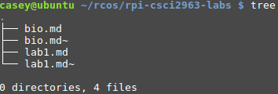

c. 2) From past experience using StackOverflow, I think "How to Answer Questions in a Helpful Way" would benefit from two additions: first, don't answer the question if you aren't qualified to answer it (some people answer questions just to do so, even if they don't really know a lot about the topic at hand; sometimes this is okay, but for the times where the answer is incorrect or misleading, the original answerer may not be able to clarify follow up questions about something that they don't fully understand themselves). Secondly, I'd like to tack on StackOverflow's concept of concise, isolated examples. If it's a programming question, an answer that puts the solution in the most precise and simplistic form is often the most useful, as you can often learn more from the simplicity and what is included than from a more cluttered answer.

c. 3) Ignoring any of the open-source related aspects of this story, I think the bigger issues of this story is that the RIAA are a bunch of crooks and that our copyright laws are really badly written. When laws (especially those regarding copyright) are written by those with a potential for profit (i.e. one of the major results of lobbying), there comes about a severe conflict of interest. The fact that the RIAA was able to scam this student out of his entire life's savings for simply altering someone else's code indicates that there are some major flaws in our legal system. Further, the fact that legal proceedings could cost so much and the victor would not receive compensation for legal fees tips the scale heavily onto the side of those with existing wealth. We thus have a system where those with wealth and power are given unfair and biased treatment in terms of law, which is a really bad thing.

  

