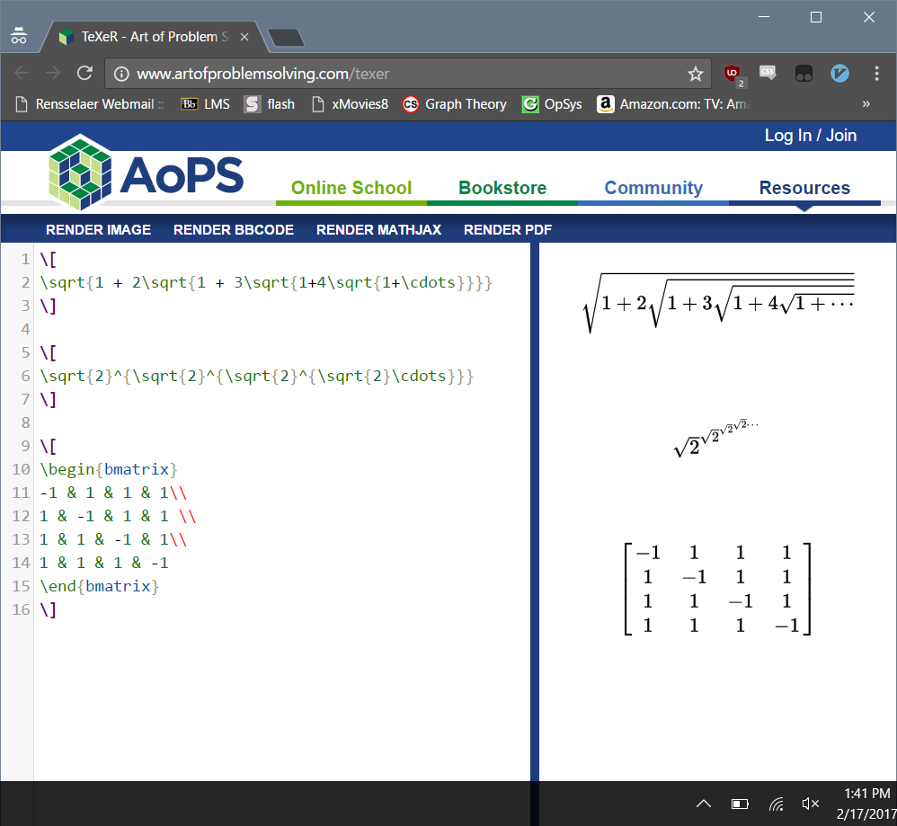

### Part 0 Documentation:
Latex stuff:

   

### Part 1 Community:
#### Myo-Intelligesture:
##### Initial stats:
* \# of Contributors: 3
* Lines of Code: 2601
* First commit: October 31st, 2014
* Latest commit: May 3rd, 2016
* Branches: master

##### Actual numbers:
* It says there are 5 authors but it's 3 on the github repo page...
* Gitstats is also saying there are 2606 lines instead of 2601.
* The first and last commit are consistent. You can see the days they worked the most too, this is crazy.

#### Oddworks
##### Initial stats:
* \# of Contributors: 9
* \# of lines: 20870
* first commit: Feb 29th, 2016 Initial Commit
* Latest commit: Feb 3, 2017
* Current branches: master, arbitrary-storage, contributing, firebase, postgres-store, riak-store

##### Actual numbers:
* This says there are 14 contributors. Weird.
* It also  says there are 20,873 lines of code, so 3 lines more.
* The report period for commits is again, consistent.

#### okcollege-web-client
###### Contributers: 4
###### Num Lines: 11488
###### Initial commit: September 12, 2016 (seveibar)
###### Latest commit: December 7, 2016 (jowlee)
###### Number of Branches: 12
| Branch name | Last Activity |
|:------------|--------------:|
| master | 2 months |
| local-storage | 2 months |
| homepage-height-fix | 2 months |
| signup-pwd | 2 months |
| form-fixes | 2 months |
| fix-local-storage | 2 months |
| basic-form | 5 months |
| landing-bstrap | 5 months |
| survey-fixes | 5 months |

##### Actual stats:
###### Line count:  8755
###### It looks like seveibar (who started the project) definitely is the project lead with the majority of the commits

#### OpenJavascriptWhiteboard
##### Initial stats:
* 15 contributors 
* lines of code: 25781
* first commit : May 12 2012
* latest commit : June 16 2016
* Current branches :
master, chatfeature, liscense, author-color, chat, chatfeature, colorful_chats, develop, fix-deps, fix-slider, formatting-and-remove-jade, gh-pages, index-page-redirect, new-ui, pdf-export, pencil-test, pencil-toll, production, readme, real-slider, revert-2-master, socket-migration, ssl, support-node-10, testJSON, timeslider, zoom.

##### Actual numbers:
* Same start and end dates: 2012-05-12 17:41:38 to 2016-06-16 14:25:59
* Total Files: 63
* Total Lines of Code: 24516 (574120 added, 549604 removed)
* Total Commits: 436 (average 5.5 commits per active day, 0.3 per all days)
* Authors: 19 (average 22.9 commits per author)
* slightly less lines than I calculated
* 19 authors vs 15 on git

As a table, we watched all of the gource videos for the above repositories. We also took a look at some bigger projects on YouTube, such as the linux kernel. We didn't end up recording the video and uploading to YouTube because none of us had enough disk space to hold the gource file.

